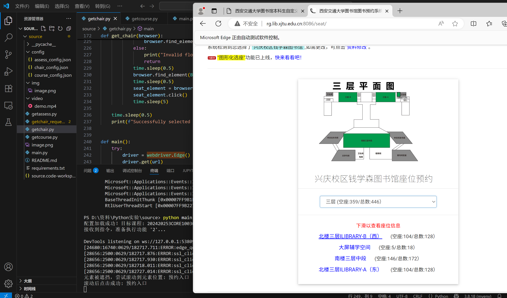

# XJTU-Toolbox - 西安交通大学自动化工具箱

**XJTU-Toolbox** 是一个专为西安交通大学学生设计的自动化脚本集合，旨在简化和自动化处理常见的校园事务（如自动评教、座位预约、预约课程等），从而节省您宝贵的时间。项目利用 Python，通过模拟浏览器操作和直接发送网络请求等方式，实现无人值守的自动化流程。

## ✨ 主要功能

本工具箱目前包含以下核心功能：

1.  📚 **自动评教 (`getassess.py`)**
    *   自动登录并完成所有课程的教学质量评价。
    *   可自定义评教内容和评语。

2.  🪑 **图书馆座位预约 (`getchair.py` & `getchair_request.py`)**
    *   提供两种抢座模式：
        *   **`快速预约`**: 基于 `Selenium` 模拟真人操作，稳定可靠。
        *   **`可视化预约`**: 基于 `requests` 直接发送网络请求，速度更快，适合在服务器上运行。
    *   支持定时抢座和自定义座位偏好。

3.  🎓 **选课助手 (`getcourse.py`)**
    *   自动监控并抢选指定的课程。


## 🚀 快速开始

### 1. 环境准备

*   安装 [Python 3.8+](https://www.python.org/downloads/)。

*   安装 [Microsoft Edge](https://www.microsoft.com/edge)。

*   下载与你的浏览器版本匹配的 [WebDriver](https://developer.microsoft.com/en-us/microsoft-edge/tools/webdriver/) (Edge) 

*   **重要**: 将下载的 `msedgedriver.exe` 放置到 Python 的安装目录下的 Scripts目录下，或者将其所在目录添加到系统的 `PATH` 环境变量中。

### 2. 安装依赖

克隆或下载本项目到本地，然后在项目根目录下打开终端，运行以下命令安装所有必需的 Python 库：

```bash
pip install -r requirements.txt
```

### 3. 参数配置

在开始使用前，你需要配置两个地方：

*   **`config/` 目录**: 这个目录存放了各个功能的详细配置文件。每个配置文件都需要配置账号密码
    *   `assess_config.json`: 配置自动评教的评语等。
    *   `chair_config.json`: 配置抢座的目标时间、座位等，优先抢配置的座位。
        - 在使用快速预约时注意由于有三个区域的座位号直接以数字开头，所以硬编码北楼四层西南侧为Q开头，北楼四层东南侧为T开头，如果选择南楼三层中段则直接填写数字，使用可视化预约时，请保证座位区域与座位是对应的。
        ```bash
            #二楼
            北楼二层外文库（东）
            二层连廊及流通大厅
            北楼二层外文库（西）
            南楼二层大厅
            #三楼
            北楼三层ILibrary-B（西）
            大屏辅学空间
            南楼三层中段
            北楼三层ILibrary-A（东）
            #四楼
            北楼四层西侧
            北楼四层中间
            北楼四层东侧
            北楼四层西南侧
            北楼四层东南侧
        ```
    *   `course_config.json`: 配置要抢的课程代码等。
        - teachingClassId 为目标课程的学期+课程号+班级号，例如2024-2025第三学期小学期，课程号为CORE100103，班级号为01，对应的 teachingClassId 为 202420253CORE10010301
        - electiveBatchCode 为选课轮次编号，可通过检查浏览器选择轮次元素得到，图中code项就是选课轮次编号
        - teachingClassType 为课程类型编号，主修推荐课程为TJKC,基础通识类为XGXK
    请根据你的需求，用文本编辑器打开并修改这些 `.json` 文件。

### 4. 运行程序

**执行功能**

通过主控脚本 `main.py` 来调用你想要的功能。

```bash
# 查看所有可用功能的帮助信息
python main.py -h

# 示例：执行自动评教 (功能 '1')
python main.py 1

# 示例：执行快速抢座 (功能 '2')
python main.py 2

# 示例：执行可视化抢座 (功能 '3')
python main.py 3

# 示例：执行抢课 (功能 '4')
python main.py 4
```

### 5. 功能示例




## ⚠️ 注意事项

*   本工具仅供个人学习和技术交流使用，请遵守学校相关规定，不要用于任何商业或非法用途。
*   由于学校网站可能会更新，脚本可能会失效。如果遇到问题，欢迎提出 Issue。
*   请妥善保管你的 config 文件，避免泄露个人信息。
